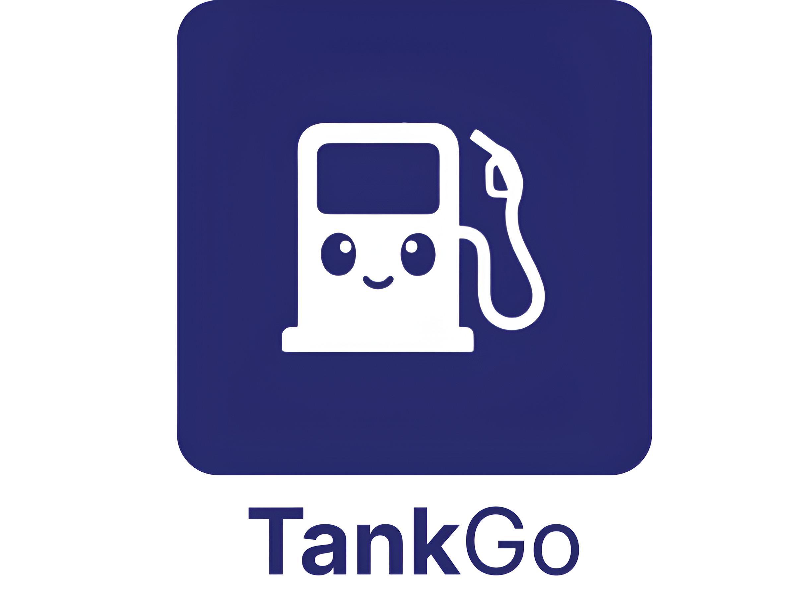

# 🚗 TankGo - Plataforma de Gasolineras

<div align="center">




**Encuentra las gasolineras más baratas de España**

[Demo en vivo](https://tankgo.onrender.com) · [Documentación API](https://gateway-gzzi.onrender.com/docs)

</div>

---

## 📋 Descripción

TankGo es una plataforma modular para consultar, gestionar y visualizar información de gasolineras en España. Utiliza datos oficiales del Ministerio de Industria y permite a los usuarios encontrar las estaciones de servicio más económicas cerca de su ubicación.

### ✨ Características Principales

- 🔍 **Búsqueda inteligente** - Filtros por provincia, municipio, marca y precio
- 📍 **Geolocalización** - Encuentra gasolineras cercanas automáticamente
- 🗺️ **Mapa interactivo** - Visualiza gasolineras con logos de marcas
- 📊 **Historial de precios** - Gráficos de evolución temporal
- ❤️ **Favoritos** - Guarda tus gasolineras preferidas
- 📱 **PWA** - Instálala en tu móvil como app nativa
- 🔐 **Autenticación** - Login tradicional y Google OAuth
- 🌍 **Multiidioma (i18n)** - Interfaz disponible en Español, English y Euskera

---

## 🏗️ Arquitectura

```
┌─────────────────────────────────────────────────────────────────┐
│                         CLIENTE                                 │
│  ┌─────────────────────────────────────────────────────────┐    │
│  │           Frontend (React + Vite + TailwindCSS)         │    │
│  │                    PWA Ready                            │    │
│  └─────────────────────────────────────────────────────────┘    │
└─────────────────────────────────────────────────────────────────┘
                              │
                              ▼
┌─────────────────────────────────────────────────────────────────┐
│                      API GATEWAY (Hono)                         │
│  ┌─────────────────────────────────────────────────────────┐    │
│  │  • Proxy reverso          • OAuth Handler               │    │
│  │  • Agregación OpenAPI     • CORS                        │    │
│  │  • Health checks          • Rate limiting               │    │
│  └─────────────────────────────────────────────────────────┘    │
└─────────────────────────────────────────────────────────────────┘
                    │                       │
                    ▼                       ▼
┌──────────────────────────────┐  ┌──────────────────────────────┐
│    Usuarios Service          │  │    Gasolineras Service       │
│    (Fastify + PostgreSQL)    │  │    (FastAPI + MongoDB)       │
│                              │  │                              │
│  • Autenticación JWT         │  │  • Datos del gobierno        │
│  • Google OAuth              │  │  • Búsqueda geoespacial      │
│  • Gestión favoritos         │  │  • Historial precios         │
│  • Perfil usuario            │  │  • Estadísticas              │
└──────────────────────────────┘  └──────────────────────────────┘
            │                              │
            ▼                              ▼
    ┌──────────────┐              ┌──────────────┐
    │  PostgreSQL  │              │   MongoDB    │
    └──────────────┘              └──────────────┘
```

---

## 🛠️ Servicios

| Servicio | Stack | Puerto | Descripción |
|----------|-------|--------|-------------|
| **Frontend** | React, Vite, TailwindCSS | 80 | SPA con PWA |
| **Gateway** | Hono (Node.js) | 8080 | Proxy y OAuth |
| **Usuarios** | Fastify, PostgreSQL | 3001 | Auth y favoritos |
| **Gasolineras** | FastAPI, MongoDB | 8000 | Datos y búsquedas |
| **MongoDB** | Base de datos | 27017 | Datos de gasolineras |
| **PostgreSQL** | Base de datos | 5432 | Datos de usuarios |

---

## 🚀 Inicio Rápido

### 📋 Requisitos Previos

| Software | Versión Mínima | Descripción |
|----------|----------------|-------------|
| [Docker Desktop](https://docs.docker.com/get-docker/) | 20.10+ | Contenedores y Docker Compose |
| [Git](https://git-scm.com/) | 2.0+ | Control de versiones |

> ⚠️ **Importante**: Docker Desktop incluye Docker Compose. No necesitas instalarlo por separado.

### 🐳 Instalación con Docker Compose (Recomendado)

Todo el proyecto está diseñado para ejecutarse con Docker Compose. **No necesitas instalar Node.js, Python, PostgreSQL o MongoDB en tu máquina**.

> 🏠 **Desarrollo Local**: Al usar Docker Compose, todas las bases de datos (PostgreSQL y MongoDB) se ejecutan localmente en contenedores. No se conecta a servicios externos como Neon o MongoDB Atlas.

#### 1️⃣ Clonar el repositorio

```bash
git clone https://github.com/ikeralvis/gasolineras_project.git
cd gasolineras_project
```

#### 2️⃣ Configurar variables de entorno

```powershell
# Windows (PowerShell)
Copy-Item .env.example .env

# Linux/Mac
cp .env.example .env
```

**Configuración mínima requerida en `.env`:**

```env
# JWT Secret - OBLIGATORIO generar uno seguro
JWT_SECRET=genera-un-secreto-seguro-de-32-caracteres

# Google OAuth (opcional, solo si quieres login con Google)
GOOGLE_CLIENT_ID=tu-client-id.apps.googleusercontent.com
GOOGLE_CLIENT_SECRET=tu-client-secret
```

> 💡 **Tip**: Para generar un JWT_SECRET seguro, ejecuta:
> ```powershell
> # Windows PowerShell
> .\generate-jwt-secret.ps1
> ```

#### 3️⃣ Levantar todos los servicios

```bash
docker-compose up -d --build
```

Este comando:
- 📦 Descarga las imágenes necesarias (MongoDB, PostgreSQL)
- 🔨 Compila todos los servicios
- 🚀 Inicia los contenedores en orden correcto
- 🔗 Configura la red entre servicios

#### 4️⃣ Verificar estado de los servicios

```bash
docker-compose ps
```

Deberías ver todos los servicios en estado `healthy` o `running`:

```
NAME                  STATUS              PORTS
frontend-client       Running             0.0.0.0:80->80/tcp
gateway-hono          Running (healthy)   0.0.0.0:8080->8080/tcp
gasolineras-service   Running (healthy)   0.0.0.0:8000->8000/tcp
usuarios-service      Running (healthy)   0.0.0.0:3001->3001/tcp
postgres              Running (healthy)   0.0.0.0:5432->5432/tcp
mon                   Running             0.0.0.0:27017->27017/tcp
```

#### 5️⃣ Acceder a la aplicación

| Servicio | URL | Descripción |
|----------|-----|-------------|
| 🌐 **Frontend** | http://localhost | Aplicación web principal |
| 📖 **API Docs** | http://localhost:8080/docs | Documentación Swagger |
| 🏥 **Health Check** | http://localhost:8080/health | Estado de todos los servicios |
| 🔧 **Gateway** | http://localhost:8080 | API Gateway |
| 👤 **Usuarios API** | http://localhost:3001 | Servicio de usuarios (interno) |
| ⛽ **Gasolineras API** | http://localhost:8000 | Servicio de gasolineras (interno) |

#### 6️⃣ Comandos útiles de Docker

```bash
# Ver logs de todos los servicios
docker-compose logs -f

# Ver logs de un servicio específico
docker-compose logs -f gateway

# Reiniciar un servicio
docker-compose restart gateway

# Detener todos los servicios
docker-compose down

# Detener y eliminar volúmenes (¡borra datos!)
docker-compose down -v

# Reconstruir un servicio específico
docker-compose up -d --build gateway
```

---

## 📖 API Endpoints

### Gateway (puerto 8080)

```
GET  /health                       # Estado de servicios
GET  /docs                         # Swagger UI
GET  /openapi.json                 # OpenAPI spec
```

### Usuarios (`/api/usuarios`)

```
POST /register                     # Registrar usuario
POST /login                        # Iniciar sesión
GET  /me                           # Perfil actual
PATCH /me                          # Actualizar perfil
GET  /google                       # OAuth Google
```

### Favoritos (`/api/usuarios/favoritos`)

```
GET  /                             # Listar favoritos
POST /                             # Añadir favorito
DELETE /{ideess}                   # Eliminar favorito
```

### Gasolineras (`/api/gasolineras`)

```
GET  /                             # Listar (con filtros)
GET  /{id}                         # Detalle
GET  /cerca?lat=X&lon=Y&km=Z       # Cercanas
GET  /estadisticas                 # Stats de precios
GET  /{id}/historial?dias=30       # Historial precios
GET  /{id}/cercanas                # Gasolineras cercanas
POST /markers                      # Markers por viewport (clusters/estaciones desde BD)
POST /sync                         # Sincronizar datos
GET  /count                        # Total
```

`POST /api/gasolineras/sync` es un endpoint interno. Debe invocarse solo desde jobs internos (cron/scheduler) enviando `X-Internal-Secret`.

---

## 🔐 Seguridad y Despliegue Cloud

- El frontend usa sesion por cookie `httpOnly` gestionada por el gateway.
- Las llamadas autenticadas del frontend deben usar `credentials: include`.
- En produccion, configura `FRONTEND_URLS` en el gateway con los dominios permitidos (separados por coma).
- Configura el mismo `INTERNAL_API_SECRET` en `gateway-hono` y `gasolineras-service` para proteger `/sync`.
- En HTTPS de cloud, habilita cookies seguras (`Secure`) y evita exponer JWT en `localStorage`.

---

## 🔧 Configuración

### Variables de Entorno

El archivo `.env.example` contiene todas las variables necesarias. Copia a `.env` y configura:

#### 🔌 Puertos de Servicios

```env
FRONTEND_PORT=80        # Frontend React
GATEWAY_PORT=8080       # API Gateway Hono
USUARIOS_PORT=3001      # Servicio de usuarios
GASOLINERAS_PORT=8000   # Servicio de gasolineras
POSTGRES_PORT=5432      # Base de datos PostgreSQL
MONGO_PORT=27017        # Base de datos MongoDB
```

#### 🗄️ Bases de Datos

```env
# PostgreSQL (usuarios)
DB_USER=postgres
DB_PASSWORD=admin
DB_NAME=usuarios_db

# MongoDB (gasolineras)
MONGO_INITDB_ROOT_USERNAME=user_gasolineras
MONGO_INITDB_ROOT_PASSWORD=secret_mongo_pwd
MONGO_DB_NAME=db_gasolineras
```

#### 🔐 Autenticación

```env
# JWT - OBLIGATORIO cambiar en producción
JWT_SECRET=tu-secreto-jwt-seguro-de-32-caracteres-minimo
JWT_EXPIRES_IN=7d

# Seguridad entre servicios
INTERNAL_API_SECRET=secreto-interno-para-comunicacion-servicios
```

#### 🔑 Google OAuth (Opcional)

Para habilitar login con Google:

1. Ve a [Google Cloud Console](https://console.cloud.google.com/)
2. Crea un proyecto y habilita Google+ API
3. Configura OAuth 2.0 credentials
4. Añade las URLs de redirect autorizadas

```env
GOOGLE_CLIENT_ID=xxx.apps.googleusercontent.com
GOOGLE_CLIENT_SECRET=xxx
```

#### 🌐 URLs

```env
FRONTEND_URL=http://localhost:80
GATEWAY_URL=http://localhost:8080
ALLOWED_ORIGINS=http://localhost:80,http://localhost:5173
```

---

## 📱 PWA (Progressive Web App)

TankGo es una Progressive Web App que puedes instalar:

1. Abre la app en Chrome/Edge
2. Haz clic en "Instalar" en la barra de direcciones
3. ¡Disfruta de la app como nativa!

**Características PWA:**
- ✅ Instalable en móvil y desktop
- ✅ Funciona offline (datos cacheados)
- ✅ Shortcuts de inicio rápido
- ✅ Iconos optimizados

---

## 🌍 Internacionalización (i18n)

TankGo está completamente traducido a **3 idiomas**:

| Idioma | Código | Bandera | Cobertura |
|--------|--------|---------|-----------|
| **Español** | `es` | 🇪🇸 | 100% (idioma por defecto) |
| **English** | `en` | 🇬🇧 | 100% |
| **Euskera** | `eu` |  | 100% |

### 📝 Secciones Traducidas

Toda la interfaz está traducida, incluyendo:

- ✅ **Página principal** - Hero section, características, pasos
- ✅ **Navegación** - Menú, links, acciones
- ✅ **Autenticación** - Login, registro, validaciones
- ✅ **Gasolineras** - Listado, filtros, ordenación, estadísticas
- ✅ **Mapa** - Controles, tooltips, ubicación
- ✅ **Favoritos** - Lista, estados vacíos, acciones
- ✅ **Perfil** - Información, preferencias, configuración
- ✅ **Detalle de gasolinera** - Precios, ubicación, gasolineras cercanas
- ✅ **Historial de precios** - Gráficas, leyendas, estadísticas
- ✅ **Mensajes del sistema** - Errores, éxitos, validaciones
- ✅ **Tablas** - Cabeceras, paginación, ordenación
- ✅ **Filtros avanzados** - Labels, placeholders, opciones

### 🔧 Implementación Técnica

```javascript
// Stack i18n
- react-i18next: ^15.3.5
- i18next: ^25.7.0
- i18next-browser-languagedetector: ^8.2.0

// Archivos de traducción
frontend-client/src/i18n/
├── index.ts                 # Configuración i18n
└── locales/
    ├── es.json             # Español (95+ claves)
    ├── en.json             # English (95+ claves)
    └── eu.json             # Euskera (95+ claves)
```

### 🎯 Uso en Componentes

```tsx
import { useTranslation } from 'react-i18next';

function MiComponente() {
  const { t } = useTranslation();
  
  return (
    <div>
      <h1>{t('home.title')}</h1>
      <p>{t('home.description')}</p>
      <button>{t('common.save')}</button>
    </div>
  );
}
```

### 🔀 Cambio de Idioma

El selector de idioma está disponible en la barra de navegación con:
- 🇪🇸 Bandera de España (Español)
- 🇬🇧 Bandera de Reino Unido (English)
-  Ikurriña (Euskera)

La preferencia de idioma se guarda en **localStorage** y persiste entre sesiones.

---

## 🔍 Filtros Avanzados

### Filtros disponibles
- **Provincia y Municipio**: Autocompletado inteligente
- **Marca**: Repsol, Cepsa, BP, Shell, Galp, Eroski, Petronor, Carrefour...
- **Precio máximo**: Define tu límite
- **Tipo de combustible**: Gasolina 95, 98, Diésel, GLP...

---

## 🧪 Testing

Ver [Guía de Testing y CI/CD](./docs/TESTING_CI_GUIDE.md) para:

- Tests unitarios por servicio
- Tests de integración
- Tests E2E con Playwright/Cypress
- Configuración de GitHub Actions

```bash
# Frontend
cd frontend-client && pnpm test

# Usuarios
cd usuarios-service && npm test

# Gasolineras
cd gasolineras-service && pytest
```

---

## 📂 Estructura del Proyecto

```
gasolineras_project/
├── frontend-client/          # React SPA + PWA
│   ├── src/
│   │   ├── components/       # Componentes reutilizables
│   │   ├── pages/            # Páginas/vistas
│   │   ├── contexts/         # Context API
│   │   ├── api/              # Llamadas a API
│   │   └── services/         # Servicios (auth)
│   └── public/               # Assets + Service Worker
│
├── gateway-hono/             # API Gateway
│   └── src/
│       └── index.js          # Proxy + OAuth
│
├── usuarios-service/         # Microservicio usuarios
│   └── src/
│       ├── routes/           # Endpoints
│       ├── hooks/            # Middleware auth
│       └── utils/            # Validadores
│
├── gasolineras-service/      # Microservicio gasolineras
│   └── app/
│       ├── routes/           # Endpoints
│       ├── models/           # Schemas
│       ├── services/         # Lógica de negocio
│       └── db/               # Conexión MongoDB
│
├── docs/                     # Documentación
├── docker-compose.yml        # Orquestación
└── .env.example              # Template de config
```

---

## 🚀 Despliegue

### 🏠 Local (Docker Compose)

```bash
docker-compose up -d --build
```

Con Docker Compose todo se ejecuta localmente:
- ✅ PostgreSQL y MongoDB en contenedores locales
- ✅ Sin dependencias de servicios en la nube
- ✅ Datos persistidos en volúmenes Docker

### ☁️ Producción (Render)

En producción, cada servicio está desplegado en [Render](https://render.com/) con bases de datos gestionadas:

| Servicio | URL de Producción | Base de Datos |
|----------|-------------------|---------------|
| 🌐 **Frontend** | https://tankgo.onrender.com | - |
| 🔧 **Gateway** | https://gateway-gzzi.onrender.com | - |
| 👤 **Usuarios** | https://usuarios-service.onrender.com | [Neon](https://neon.tech/) (PostgreSQL) |
| ⛽ **Gasolineras** | https://gasolineras-service.onrender.com | [MongoDB Atlas](https://www.mongodb.com/atlas) |

**Características de producción:**
- 🔐 HTTPS habilitado en todos los servicios
- 📊 Bases de datos gestionadas con backups automáticos
- 🔄 Despliegue automático con GitHub (CI/CD)
- 📈 Escalado automático según demanda

---

## 🤝 Contribuir

1. Fork del repositorio
2. Crear rama (`git checkout -b feature/nueva-funcionalidad`)
3. Commit (`git commit -m 'Añadir funcionalidad'`)
4. Push (`git push origin feature/nueva-funcionalidad`)
5. Pull Request

---

## 📝 Licencia

MIT © [Iker Alvis](https://github.com/ikeralvis)

---

<div align="center">

Desarrollado con ❤️ para el proyecto TankGo

[⬆ Volver arriba](#-tankgo---plataforma-de-gasolineras)

</div>
